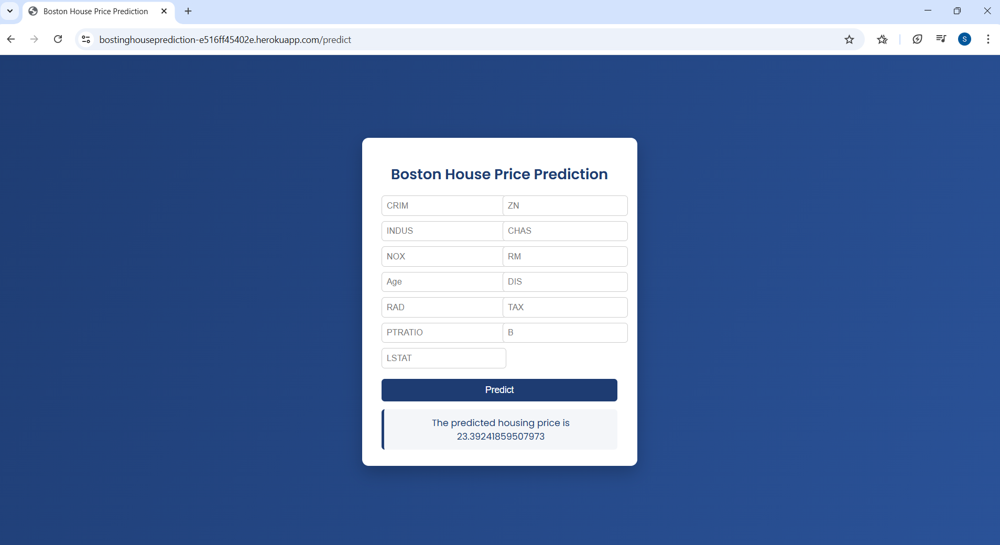

# 🏠 Boston House Price Prediction

A full-stack machine learning web application for predicting **Boston house prices** using a **Linear Regression model**, containerized with **Docker** and deployed via **GitHub Actions CI/CD** to a **Heroku application**.

This project demonstrates the **complete machine learning lifecycle**, from data analysis and model training to deployment and automation.

---

## 📌 Project Overview

The goal of this project is to predict the **median value of owner-occupied homes in Boston** based on multiple socio-economic and environmental factors.

The project covers:
- Data exploration and visualization
- Feature scaling and model training
- Model evaluation and serialization
- Flask-based web application
- Docker containerization
- Automated deployment using GitHub Actions and Heroku

A screenshot of the deployed application interface is included in this repository (see below).

---

## 🖼️ Application Screenshot

The image below shows the deployed web interface for predicting house prices.



---

## 🧠 Dataset

The model is trained on the **Boston Housing Dataset**, originally published by:

> Harrison, D. and Rubinfeld, D.L.  
> *Hedonic prices and the demand for clean air*,  
> Journal of Environmental Economics and Management, 1978.

### Features (13):
- **CRIM** – Per capita crime rate
- **ZN** – Proportion of residential land zoned
- **INDUS** – Proportion of non-retail business acres
- **CHAS** – Charles River dummy variable
- **NOX** – Nitric oxide concentration
- **RM** – Average number of rooms per dwelling
- **AGE** – Proportion of old owner-occupied units
- **DIS** – Distance to employment centers
- **RAD** – Accessibility to highways
- **TAX** – Property tax rate
- **PTRATIO** – Pupil-teacher ratio
- **B** – Proportion of Black population
- **LSTAT** – % lower status of population

### Target:
- **MEDV** – Median house value (in $1000s)

---

## 🔍 Exploratory Data Analysis & Model Training

All data preprocessing, visualization, and model training were carried out in a **Jupyter Notebook**, which is included in this repository.

### Key steps:
- Data loading and inspection
- Correlation analysis and visualization
- Train-test split
- Feature scaling using `StandardScaler`
- Linear Regression model training
- Model evaluation using:
  - R² Score
  - Adjusted R²
  - Mean Squared Error (MSE)
  - Mean Absolute Error (MAE)

### Model Performance:
- **R² Score:** ~0.71  
- **Adjusted R²:** ~0.68  
- **MAE:** ~3.16  

The trained model and scaler were saved using `pickle` for deployment.

📓 Notebook file:

---

## 💻 Web Application

The web application is built with **Flask** and allows users to input housing features through a web form and receive real-time predictions.

### Features:
- Clean HTML interface
- Input validation
- Scaled feature transformation
- Server-side prediction using the trained model
- Prediction output rendered on the UI

---

## 🐳 Docker Containerization

The application is fully containerized using **Docker**, ensuring:
- Environment consistency
- Reproducible builds
- Easy deployment across environments

The Docker setup installs dependencies, copies application files, and runs the app using **Gunicorn**.

---

## 🚀 CI/CD with GitHub Actions & Heroku

This project uses **GitHub Actions** for continuous integration and deployment.

### Deployment Workflow:
1. Code is pushed to the `main` branch
2. GitHub Actions builds a Docker image
3. The image is pushed to Heroku Container Registry
4. The container is released automatically to the Heroku app

This enables **fully automated deployment** with no manual intervention.


---

## 🧾 Project Structure

```text
housing/
│
├── app.py
├── Dockerfile
├── Procfile
├── requirements.txt
├── linear_regression_model.pkl
├── scaler.pkl
├── ETE.ipynb
├── images/
│   └── app_screenshot.png
├── templates/
│   └── home.html
├── .github/
│   └── workflows/
│       └── main.yaml
└── README.md

Run Locally
git clone https://github.com/IDOWUMAYOWA/housing.git
cd housing
pip install -r requirements.txt
python app.py